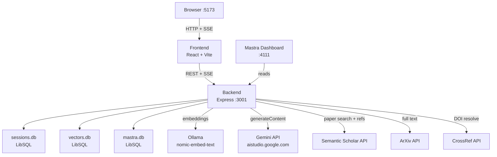
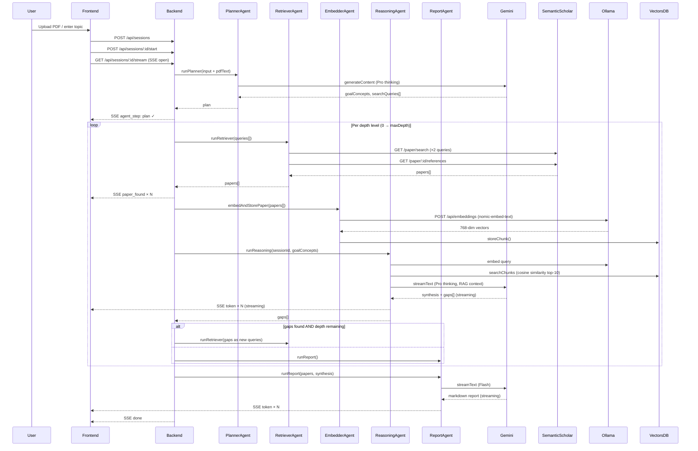
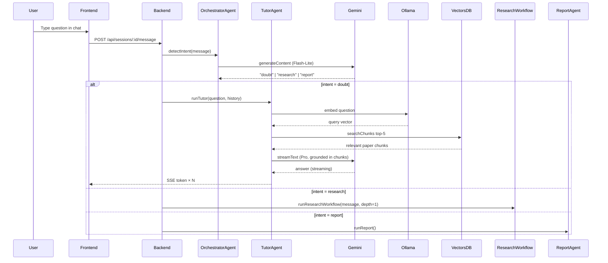
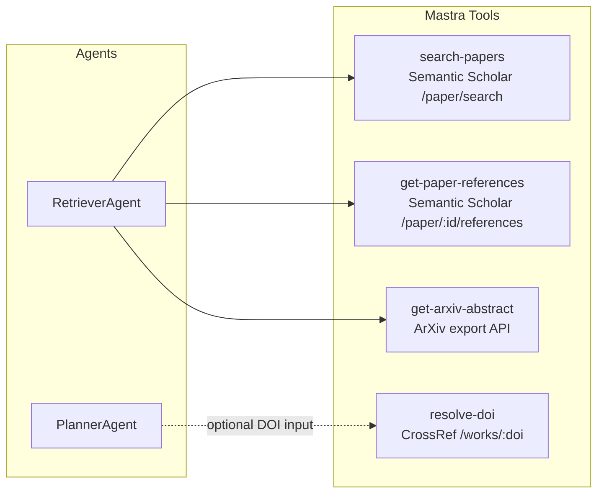
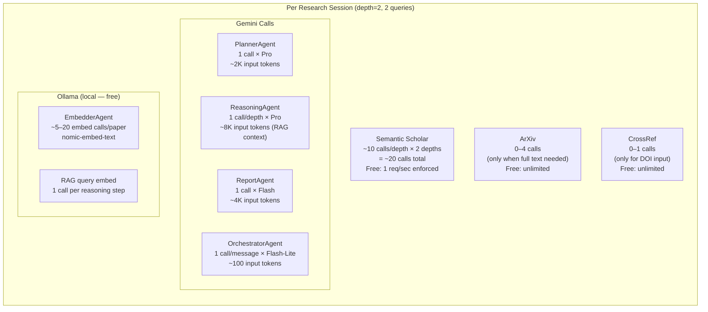
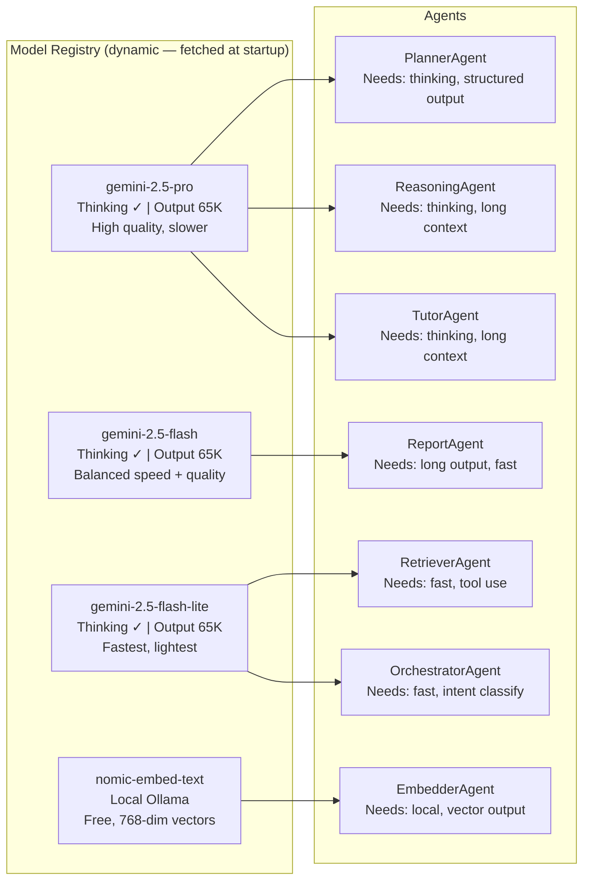
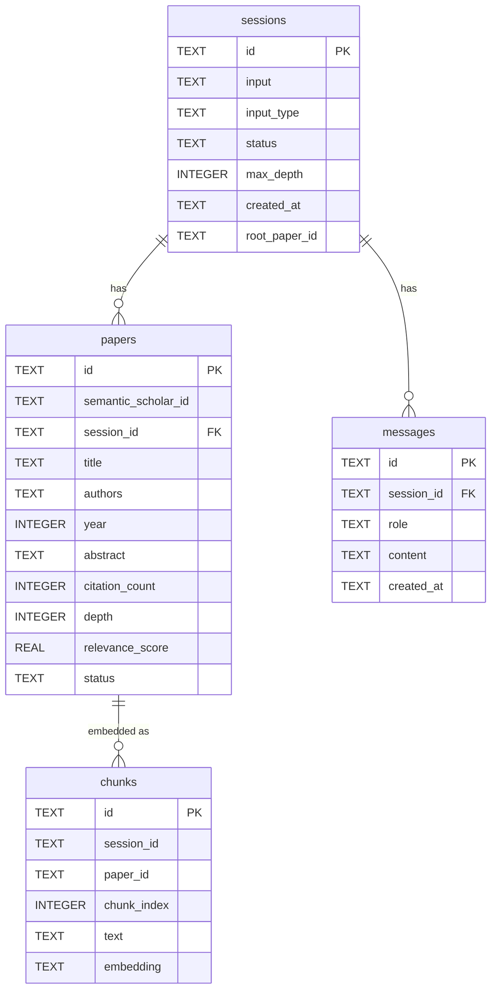
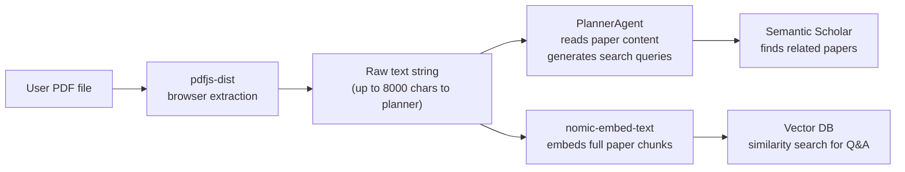

# Architecture

## System Components

---

## Research Workflow

---

## Q&A / Tutor Flow

---

## Tool Call Map

---

## API Call Cost & Weight

---

## Model Assignment by Role

---

## Storage Layout

---

## Data Flow: PDF Upload Path

